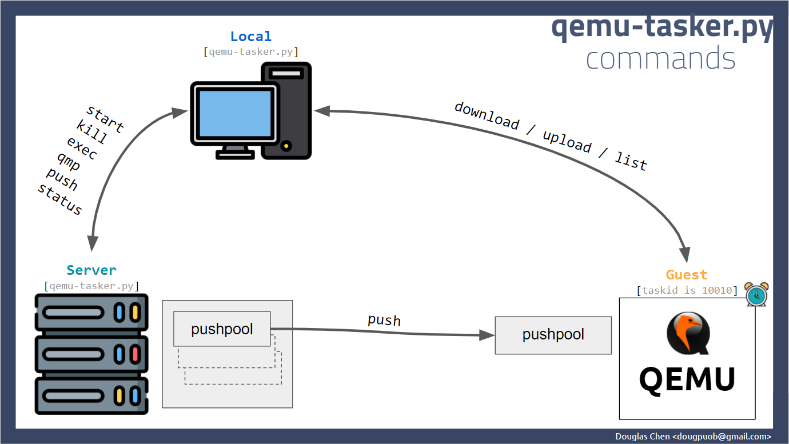
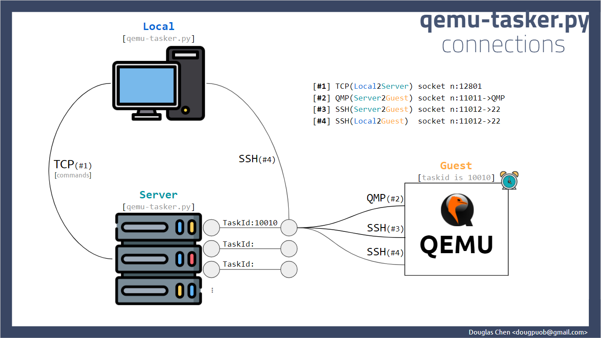

# qemu-tasker

The `qemu-tasker` is a server-client Python program. One server manages multiple QEMU instances making your control QEMU(backend) and communicate with its Guest OS side by commands. This project is inspired by implementing system testing in continuous integration (CI). It launch QEMU processes then connect QMP to the backend of QEMU and SSH to the guest operating system, then collect system resources by killing those processes in time, which is an option in config when launching.






----------

### Requirements

1. A Linux machine as the server which should support KVM.
2. Guest operating system installed QCOW2 images.
3. Setup OpenSSH server in those guest operating system images.
4. Create your own start config json file, reference to `src/qemu-taskcfg.json` in this project. Suggest to add `snapshot=on` at the drive option, like `"-drive", "file=windows-10-20h2.qcow2,format=qcow2,snapshot=on"`.


``` bash
pip3 install psutil
pip3 install ssh2-python
pip3 install pyftpdlib
```

----------

### Quick Start
The server IP is `172.17.100.17`.

#### Server side (Governor):
1. Start the server.
   - `python3 qemu-tasker.py --host 172.17.100.17 server --config setting.json`

#### Server side (Puppet):
[!run-puppet-server.ps1](script/run-puppet-server.ps1)

#### Local side:
1. Query server information.
   - `python3 qemu-tasker.py --host 172.17.100.17 info`
1. Start an QEMU machine.
   - `python3 qemu-tasker.py --host 172.17.100.17 start --config qemu-taskcfg-01.json`
1. Execute a command on Guest OS.
   - `python3 qemu-tasker.py --host 172.17.100.17 exec --taskid 10010 --program ipconfig`

----------

## Commands
There are three types commands with this project.

### Control commands
The `server` command to start a daemon as a server manage all QEMU instances and send/receive commands from clients; the `start` command to launch a QEMU program, options for QEMU in a JSON config file. the server will response you an unique <TASKID> to identify the QEMU process; the `kill` command to kill a QEMU instance by its <TASKID>; the `exec` command to execute command by SSH; the `qmp` command to communicate with QEMU Machie Protocol(QMP), of cause you can send HMP via QMP.

1. `server`
1. `start`
1. `kill`
1. `exec`
1. `qmp`
1. `status`

### File transfer commands
1. `download`
1. `upload`
1. `list`

### Synchronization commands
1. `push`
1. `signal`

```
❯ python3 qemu-tasker.py --help

usage: qemu-tasker.py [-h] [-H HOST] [-P PORT] [-J] [-V] {server,start,kill,
exec,qmp,list,download,upload,push,status,info} ...

positional arguments:
  {server,start,kill,exec,qmp,list,download,upload,push,status,info}
    server              start a server daemon
    start               launch a QEMU achine instance
    kill                kill the specific QEMU machine instance
    exec                execute a specific command at guest operating system
    qmp                 execute a specific QMP command
    list                list files from local to guest
    download            download files from guest to local
    upload              upload files from local to guest
    push                update files from local to guest
    status              query a specific QEMU status
    info                get server system information

optional arguments:
  -h, --help            show this help message and exit
  -H HOST, --host HOST
  -P PORT, --port PORT
  -J, --jsonreport
  -V, --verbose
```

----------

## Examples

### Server
``` bash
❯ python3 qemu-tasker.py --host 192.168.0.201 server \
                         --config src/setting.json
```

### Info
``` bash
❯ python3 qemu-tasker.py --host 192.168.0.201 \
                         --jsonreport \
                         info
# Responsed JSON data
{
  "act_kind": "response",
  "cmd_kind": "info",
  "data": {
    "image_files": [
      "abc.qcow2",
      "windows-10-20h2.qcow2"
    ],
    "name": "info_command_response_data",
    "variables": {
      "SERVER_PUSHPOOL_DIR": "./data/pushpool",
      "SERVER_QCOW2_IMAGE_DIR": "/home/dougpuob/workspace/qemu-runner/"
    }
  },
  "result": {
    "data": null,
    "errcode": 0,
    "error_lines": [
      ""
    ],
    "info_lines": []
  }
}


```

### Start
``` bash
❯ python3 qemu-tasker.py --host 192.168.0.201 \
                         --jsonreport \
                         start \
                         --config qemu-taskcfg.json
# Responsed JSON data
{
  "act_kind": "response",
  "cmd_kind": "start",
  "data": {
    "forward": {
      "qmp": 10011,
      "ssh": 10012
    },
    "guest_info": {
      "os_kind": "unknown",
      "pushpool_path": "",
      "workdir_path": ""
    },
    "is_connected_qmp": {},
    "is_connected_ssh": {},
    "name": "start_command_response_data",
    "pid": 245002,
    "server_info": {
      "pushpool_path": "/home/dougpuob/workspace/dougpuob/qemu-tasker/qemu-tasker.git/pushpool/20220321_132055_10010",
      "workdir_path": "/home/dougpuob/workspace/dougpuob/qemu-tasker/qemu-tasker.git"
    },
    "ssh": {
      "account": {
        "password": "dougpuob",
        "username": "dougpuob"
      },
      "target": {
        "address": "192.168.0.201",
        "port": 12801
      }
    },
    "taskid": 10010
  },
  "result": {
    "data": null,
    "errcode": 0,
    "error_lines": [],
    "info_lines": []
  }
}


```

### Exec
``` bash
❯ python3 qemu-tasker.py --host 192.168.0.201 \
                         --jsonreport \
                         exec \
                         --taskid 10010 \
                         --program "ipconfig" \
                         --argument "/all"
# Responsed JSON data
{
  "act_kind": "response",
  "cmd_kind": "exec",
  "data": {
    "name": "generic_command_response_data",
    "taskid": 10010
  },
  "result": {
    "data": null,
    "errcode": 0,
    "error_lines": [],
    "info_lines": [
      "",
      "Windows IP Configuration",
      "",
      "   Host Name . . . . . . . . . . . . : DESKTOP-I9TKP5J",
      "   Primary Dns Suffix  . . . . . . . : ",
      "   Node Type . . . . . . . . . . . . : Hybrid",
      "   IP Routing Enabled. . . . . . . . : No",
      "   WINS Proxy Enabled. . . . . . . . : No",
      "",
      "Ethernet adapter Ethernet Instance 0:",
      "",
      "   Connection-specific DNS Suffix  . : ",
      "   Description . . . . . . . . . . . : Intel(R) PRO/1000 MT Network Connection #2",
      "   Physical Address. . . . . . . . . : 52-54-00-12-34-56",
      "   DHCP Enabled. . . . . . . . . . . : Yes",
      "   Autoconfiguration Enabled . . . . : Yes",
      "   Site-local IPv6 Address . . . . . : fec0::4ce8:6b94:da87:28d3%1(Preferred) ",
      "   Link-local IPv6 Address . . . . . : fe80::4ce8:6b94:da87:28d3%14(Preferred) ",
      "   IPv4 Address. . . . . . . . . . . : 10.0.2.15(Preferred) ",
      "   Subnet Mask . . . . . . . . . . . : 255.255.255.0",
      "   Lease Obtained. . . . . . . . . . : Monday, March 21, 2022 6:21:10 AM",
      "   Lease Expires . . . . . . . . . . : Tuesday, March 22, 2022 6:21:09 AM",
      "   Default Gateway . . . ",
      ". . . . . . : fe80::2%14",
      "                                       10.0.2.2",
      "   DHCP Server . . . . . . . . . . . : 10.0.2.2",
      "   DHCPv6 IAID . . . . . . . . . . . : 257053696",
      "   DHCPv6 Client DUID. . . . . . . . : 00-01-00-01-29-5F-7C-32-52-54-00-12-34-56",
      "   DNS Servers . . . . . . . . . . . : 10.0.2.3",
      "   NetBIOS over Tcpip. . . . . . . . : Enabled"
    ]
  }
}
```

### QMP

``` bash
❯ python3 src/qemu-tasker.py --host 192.168.0.201 \
                             --jsonreport \
                             qmp \
                             --taskid 10010 \
                             --execute human-monitor-command \
                             --argsjson '''{"command-line" : "info version" }'''
# Responsed JSON data
{
  "act_kind": "response",
  "cmd_kind": "qmp",
  "data": {
    "name": "generic_command_response_data",
    "taskid": 10010
  },
  "result": {
    "data": null,
    "errcode": 0,
    "error_lines": [],
    "info_lines": [
      {
        "return": "6.2.50v6.2.0-995-gc1d7ca1fb8\r\n"
      }
    ]
  }
}


❯ python3 src/qemu-tasker.py --host 192.168.0.201 \
                               --jsonreport \
                               qmp \
                               --taskid 10010 \
                               --execute human-monitor-command \
                               --argsjson eyJjb21tYW5kLWxpbmUiIDogImluZm8gdmVyc2lvbiIgfQ== \
                               --base64
# Responsed JSON data
{
  "act_kind": "response",
  "cmd_kind": "qmp",
  "data": {
    "name": "generic_command_response_data",
    "taskid": 10010
  },
  "result": {
    "data": null,
    "errcode": 0,
    "error_lines": [],
    "info_lines": [
      {
        "return": "6.2.50v6.2.0-995-gc1d7ca1fb8\r\n"
      }
    ]
  }
}


```

``` bash
❯ python3 qemu-tasker.py --host 172.17.100.17 \
                               --jsonreport \
                               qmp \
                               --taskid 10060 \
                               --execute human-monitor-command \
                               --argsjson='''{"command-line" : "savevm snapshot01" }'''
# Responsed JSON data
{
  "response": {
    "command": "qmp",
    "data": {
      "errcode": 0,
      "result": true,
      "stderr": "",
      "stdout": {
        "return": ""
      },
      "taskid": 10060
    }
  }
}

```

``` powershell
PS> python ./qemu-tasker.py --host 172.17.100.17 qmp \
                            --taskid 10010 \
                            --execute human-monitor-command \
                            --argsjson='{\"command-line\":\"device_add usb-winusb,id=winusb-01,pcap=winusb-01.pcap\"}'
```

### List
### Upload
### Download
### Push
### Status

----------
END