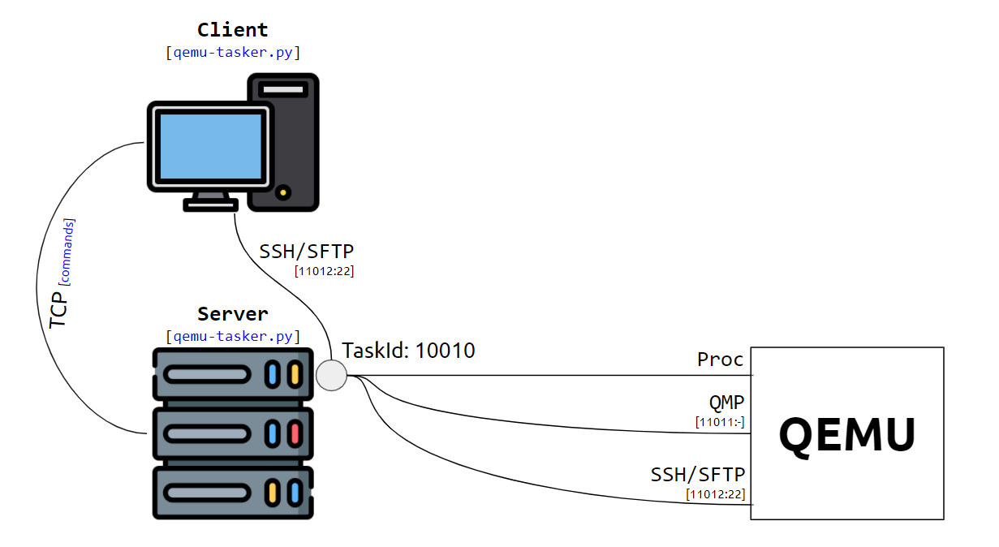

# qemu-tasker

The `qemu-tasker` project is a server-client program in Python which manage QEMU instances and communicate with them from the client side by commands. This project is inspired by implementing system testing in continuous integration (CI). It launch QEMU processes then connect QMP to the backend of QEMU and SSH to the guest operating system, then collect system resources by killing those processes in time, which is an option in config when launching.

The `server` command to start a daemon as a server manage all QEMU instances and send/receive commands from clients; the `start` command to launch a QEMU program, options for QEMU in a JSON config file. the server will response you an unique <TASKID> to identify the QEMU process; the `kill` command to kill a QEMU instance by its <TASKID>; the `exec` command to execute command by SSH; the `qmp` command to communicate with QEMU Machie Protocol(QMP), of cause you can send HMP via QMP.




----------

### Requirements

1. A Linux machine as the server which should support KVM.
2. Guest operating system installed QCOW2 images.
3. Setup OpenSSH server in those guest operating system images.
4. Create your own start config json file, reference to `src/qemu-taskcfg.json` in this project. Suggest to add `snapshot=on` at the drive option, like `"-drive", "file=windows-10-20h2.qcow2,format=qcow2,snapshot=on"`.


``` bash
pipe install psutil
```

----------

### Quick Start
The server IP is `172.17.100.17`.

1. Start the server `python3 qemu-tasker.py --host 172.17.100.17 server` at server side .
2. Start an QEMU machine `python3 qemu-tasker.py --host 172.17.100.17 --config qemu-taskcfg-01.json` at client side.


----------

## Commands

```
❯ python3 qemu-tasker.py --help

usage: qemu-tasker.py [-h] [-H HOST] [-P PORT] [-V] {server,start,kill,exec,qmp,file} ...

positional arguments:
  {server,start,kill,exec,qmp,file}
    server              start a server daemon
    start               launch a QEMU achine instance
    kill                kill the specific QEMU machine instance
    exec                execute a specific command at guest operating system
    qmp                 execute a specific QMP command
    file                transfer files between client and guest, or server and guest

optional arguments:
  -h, --help            show this help message and exit
  -H HOST, --host HOST
  -P PORT, --port PORT
  -V, --verbose

```

----------

## Examples

### Server
``` bash
❯ python3 qemu-tasker.py --host 172.17.100.17 server
```
### Start
``` bash
❯ python3 qemu-tasker.py --host 172.17.100.17 start \
                         --config config/qemu-taskcfg-01.json
```

### Exec
``` bash
❯ python3 qemu-tasker.py --host 172.17.100.17 exec \
                         --taskid 10010 \
                         --program "ipconfig" \
                         --arguments="-all"
```

### QMP

``` bash
❯ python3 qemu-tasker.py --host 172.17.100.17 qmp \
                         --taskid 10010 \
                         --execute human-monitor-command \
                         --argsjson='''{"command-line" : "info version" }'''
```

``` bash
❯ python3 qemu-tasker.py --host 172.17.100.17 qmp \
                         --taskid 10010 \
                         --execute human-monitor-command \
                         --argsjson='''{"command-line" : "savevm snapshot01" }'''
```

``` bash
❯ python3 ./qemu-tasker.py --host 172.17.100.17 qmp \
                           --taskid 10010 \
                           --execute human-monitor-command \
                           --argsjson='''{"command-line" : "savevm winusb" }'''

❯ python3 ./qemu-tasker.py --host 172.17.100.17 qmp \
                           --taskid 10010 \
                           --execute human-monitor-command \
                           --argsjson='''{"command-line" : "info snapshots" }'''

❯ python3 ./qemu-tasker.py --host 172.17.100.17 qmp \
                           --taskid 10010 \
                           --execute human-monitor-command \
                           --argsjson='''{"command-line" : "device_add usb-winusb,id=winusb-01,pcap=winusb-01.pcap" }'''

❯ python3 ./qemu-tasker.py --host 172.17.100.17 qmp \
                           --taskid 10010 \
                           --execute human-monitor-command \
                           --argsjson='''{"command-line" : "info usb" }'''
```

### File

```
# Upload a file from the server side to the QEMU guest OS.
❯ python3 ./qemu-tasker.py --host 192.168.0.201 file \
                           --taskid 10010 \
                           --kind s2g_upload \
                           --filepath "/home/dougpuob/run-smartgit.sh" \
                           --savepath "abc/aaa/bbb/run-smartgit.sh" \
                           --newdir   "abc/aaa/bbb"

# Download a file from the QEMU guest OS to the server side.
❯ python3 ./qemu-tasker.py --host 192.168.0.201 file \
                           --taskid 10010 \
                           --kind s2g_download \
                           --filepath "c:\Users\dougpuob\abc\aaa\bbb\run-smartgit.sh" \
                           --savepath "/home/dougpuob/run-smartgit.sh"

# Upload a file from the client slide to the QEMU guest OS.
❯ python3 ./qemu-tasker.py --host 192.168.0.201 file \
                           --taskid 10010 \
                           --kind c2g_upload \
                           --filepath "/home/dougpuob/run-smartgit.sh" \
                           --savepath "abc/aaa/bbb/run-smartgit.sh" \
                           --newdir "abc/aaa/bbb" \
                           --config qemu-taskcfg.json \
                           --port 10012

# Download a file from the QEMU guest OS to the client side.
❯ python3 ./qemu-tasker.py --host 192.168.0.201 file \
                           --taskid 10010 \
                           --kind c2g_download \
                           --filepath "c:\Users\dougpuob\abc\aaa\bbb\run-smartgit.sh" \
                           --savepath "/home/dougpuob/run-smartgit.sh" \
                           --config qemu-taskcfg.json \
                           --port 10012
```